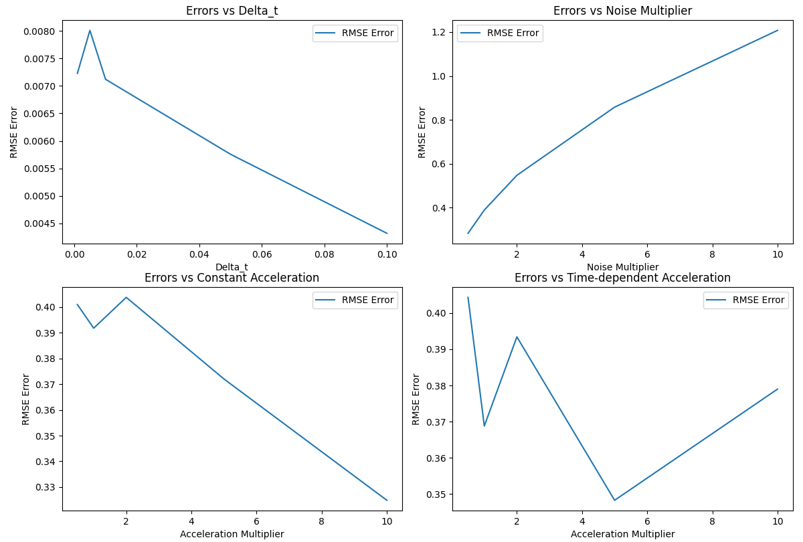

## Kalman Filter Implementation

The Kalman filter is a recursive algorithm used for estimating the state of a dynamic system from a series of measurements. In the context of missile tracking, the Kalman filter is used to estimate the position and velocity of the target aircraft based on noisy measurements from a radar system.

The state of the target aircraft is represented by a 6-dimensional vector `x = [x, y, z, vx, vy, vz]`, where `(x, y, z)` is the position and `(vx, vy, vz)` is the velocity. The system dynamics are modeled by the following linear state-space equations:

$$v_{t+1} - v_t = a_t * Δt$$
$$x_{t+1} - x_t = v_t * Δt$$

where `a_t` is the acceleration of the target aircraft, which is assumed to be known and provided as a control input.

The Kalman filter consists of two main steps: the prediction step and the update step.

### Prediction Step

In the prediction step, the Kalman filter uses the known system dynamics and the previous state estimate to predict the current state of the system. The state transition matrix `A` and the control input matrix `B` are used to compute the predicted state:

$$x_predicted = A * x_estimated + B * control_input$$
$$P_predicted = A * P * A.T + Q$$

where `x_estimated` is the previous state estimate, `P` is the previous state covariance matrix, and `Q` is the process noise covariance matrix.

### Update Step

In the update step, the Kalman filter incorporates the new measurement from the radar system to update the state estimate. The measurement model is represented by the measurement matrix `H`, which maps the state vector to the measurement vector. The Kalman gain `K` is computed based on the measurement covariance `R` and the predicted state covariance `P_predicted`:

```txt
y = measurement - H * x_predicted  # Measurement residual
S = H * P_predicted * H.T + R      # Residual covariance
K = P_predicted * H.T * np.linalg.inv(S)  # Kalman gain
x_estimated = x_predicted + K * y  # Updated state estimate
P = (np.eye(P.shape[0]) - K * H) * P_predicted  # Updated covariance
```

The updated state estimate `x_estimated` and covariance `P` are then used in the next prediction step.

## Simulate Function

The `simulate_trajectory` function is used to simulate the trajectory of the target aircraft and evaluate the performance of the Kalman filter.

The function takes the following inputs:

- `time_steps`: The number of time steps to simulate.
- `delta_t`: The time interval between each step.
- `eta`: The number of prediction steps per measurement.
- `initial_position`: The initial position of the target aircraft.
- `initial_velocity`: The initial velocity of the target aircraft.
- `acceleration`: The acceleration of the target aircraft, which can be a constant value or a time-dependent function.
- `kalman_filter`: An instance of the `MissileTrackerKalmanFilter` class.

The function simulates the true trajectory of the target aircraft based on the given initial conditions and acceleration. At each step, the Kalman filter performs `eta` prediction steps and then updates the state estimate using the simulated measurement. The true positions, estimated positions, and Euclidean errors between them are recorded and returned.

The simulated trajectory can be used to evaluate the performance of the Kalman filter under different conditions, such as varying levels of measurement noise or different acceleration profiles.

## Observations



- We can see that Scaled RMSE decrease with increase in $delta_t$ which is expected as the parameters are changing very frequently and the filter is not able to matchup the speed of the changes
- The Scaled RMSE increases with increase in measurement noise which is expected as the noise created uncertainty in the measurements
- The results in both constant acceleration and variable acceleration doesn't seems to tell us much about the performance of the filter as the RMSE is unpredictable and doesn't follow any pattern

## Authors

- Prakhar Gupta(B21AI027)
- Adarsh Raj Shrivastava(B21AI003)
